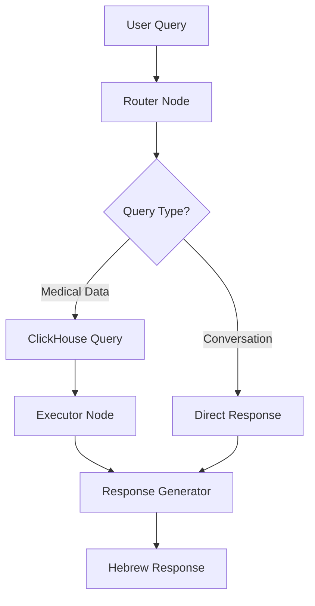

# Assota Medical Chatbot - Modular LangGraph React Agent

A production-ready medical chatbot for Assota hospital built with **LangGraph**, **React Pattern**, and **ClickHouse MCP** integration. The application follows **clean architecture principles** with **modular design** for enterprise-scale deployment.

## 🏗️ Architecture Overview

### Clean Architecture Structure
```
src/assota_chatbot/
├── agents/                  # LangGraph workflows and nodes
│   ├── nodes/              # Individual agent nodes
│   │   ├── router.py       # Query routing and classification
│   │   ├── executor.py     # Action execution (SQL queries)
│   │   └── responder.py    # Hebrew response generation
│   └── workflows/          # Complete workflow orchestration
│       └── react_agent.py  # Main React agent workflow
├── tools/                  # External integrations and tools
│   └── clickhouse/        # ClickHouse database tools
│       ├── client.py      # Async MCP client
│       └── queries.py     # Predefined SQL queries
├── models/                 # Data models and schemas
│   ├── state_models.py    # LangGraph state definitions
│   └── data_schemas.py    # Pydantic validation schemas
├── config/                 # Configuration management
│   └── settings.py        # Environment-based settings
├── utils/                  # Utilities and helpers
│   └── logging.py         # Centralized logging
├── web/                    # Web interface
│   └── app.py             # Flask application
└── main.py                # Entry point and testing
```

### React Agent Flow


## 🌟 Key Features

### Enterprise-Grade Architecture
- **Modular Design**: Separate concerns with clean interfaces
- **Type Safety**: Full Pydantic validation and type hints
- **Configuration Management**: Environment-based settings with validation
- **Comprehensive Logging**: Structured logging with configurable levels
- **Error Handling**: Graceful error handling and recovery

### Medical Intelligence
- **Hebrew Language Support**: Native Hebrew medical terminology
- **Smart Routing**: AI-powered query classification
- **Data Privacy**: Mandatory user_id filtering for HIPAA compliance
- **Medical Context**: Specialized prompts for healthcare scenarios

### Technical Excellence
- **Async Architecture**: High-performance async/await patterns
- **MCP Integration**: Model Context Protocol for database connectivity
- **LangGraph Studio**: Visual debugging and development tools
- **Production Ready**: Docker support and deployment configurations

## 🚀 Quick Start

### Prerequisites
```bash
Python 3.11+
OpenAI API key
ClickHouse Cloud access
uv package manager (recommended)
```

### 1. Installation
```bash
# Clone repository
git clone <repository-url>
cd assota-txt2sql-poc

# Install dependencies
pip install -r requirements.txt
pip install "langgraph-cli[inmem]>=0.3.6"
uv add mcp-clickhouse
```

### 2. Configuration
Create `.env` file:
```env
# OpenAI Configuration
OPENAI_API_KEY="your-openai-api-key"

# ClickHouse Cloud Configuration  
CLICKHOUSE_HOST=your-host.clickhouse.cloud
CLICKHOUSE_PORT=8443
CLICKHOUSE_USER=default
CLICKHOUSE_PASSWORD=your-password
CLICKHOUSE_SECURE=true
CLICKHOUSE_VERIFY=true

# Application Settings
DEBUG=false
HOST=127.0.0.1
PORT=5000

# Optional: LangSmith Tracing
LANGCHAIN_TRACING_V2=true
LANGSMITH_API_KEY="your-langsmith-key"
LANGCHAIN_PROJECT=assota-txt2sql-poc
```

### 3. Development with LangGraph Studio
```bash
# Start LangGraph development server
langgraph dev

# Open LangGraph Studio
# Navigate to https://smith.langchain.com/studio/?baseUrl=http://127.0.0.1:2024
```

### 4. WhatsApp-style Web Interface
```bash
# Start the WhatsApp-like web interface
python src/assota_chatbot/web/app.py

# Open in browser
# Navigate to http://127.0.0.1:5000
```

### 5. Production Deployment
```bash
# Or run with Docker
docker build -t assota-chatbot .
docker run -p 5000:5000 --env-file .env assota-chatbot
```

## 🎯 Running the Application

### Option 1: WhatsApp-Style Web Interface (Recommended for Users)
The production-ready web interface designed for end users:

```bash
# Start the web application
python src/assota_chatbot/web/app.py

# Access the interface
open http://127.0.0.1:5000
```

**Features:**
- 📱 **WhatsApp-like UI**: Familiar chat interface with Hebrew support
- 🏥 **Assuta Branding**: Hospital logos and color scheme
- 💬 **Real-time Chat**: Instant responses with typing indicators
- 🔒 **Session Management**: Secure user sessions
- 📱 **Mobile Responsive**: Works on all devices

### Option 2: LangGraph Studio (For Developers)
Visual development environment for testing and debugging:

```bash
# Start LangGraph development server
langgraph dev

# Access LangGraph Studio
open "https://smith.langchain.com/studio/?baseUrl=http://127.0.0.1:2024"
```

**Features:**
- 🔧 **Visual Debugging**: See the agent's decision flow
- 📊 **State Inspection**: Monitor agent state changes
- 🔍 **Performance Metrics**: Track execution times
- 🧪 **Testing Tools**: Test with custom inputs
- 📈 **Tracing**: Full request/response logging

### Running Both Simultaneously
You can run both interfaces at the same time for development:

```bash
# Terminal 1: Start LangGraph Studio
langgraph dev

# Terminal 2: Start Web Interface
python src/assota_chatbot/web/app.py
```

- **LangGraph Studio**: https://smith.langchain.com/studio/?baseUrl=http://127.0.0.1:2024
- **Web Interface**: http://127.0.0.1:5000

## 🔧 Development Guide

### Adding New Nodes
```python
# src/assota_chatbot/agents/nodes/new_node.py
from ...models.state_models import ReactAgentState

def my_new_node(state: ReactAgentState) -> ReactAgentState:
    # Your node logic here
    return state

def create_my_node() -> callable:
    return my_new_node
```

### Creating New Tools
```python
# src/assota_chatbot/tools/my_tool/client.py
from ...config.settings import settings

class MyToolClient:
    def __init__(self):
        self.api_key = settings.my_tool.api_key
    
    async def execute(self, query: str) -> str:
        # Tool implementation
        pass
```

### Configuration Management
```python
# src/assota_chatbot/config/settings.py
class MyToolSettings(BaseSettings):
    api_key: str = Field(env="MY_TOOL_API_KEY")
    endpoint: str = Field(default="https://api.example.com")
    
    class Config:
        env_prefix = "MY_TOOL_"
```

## 🧪 Testing

### Unit Tests
```bash
# Test individual components
python -m pytest tests/test_agents/
python -m pytest tests/test_tools/
```

### Integration Tests
```bash
# Test the complete workflow
python src/assota_chatbot/main.py

# Test web interface
python src/assota_chatbot/web/app.py
curl http://localhost:5000/test
```

### WhatsApp UI Testing
```bash
# Test the web interface
curl http://localhost:5000/health
curl -X POST http://localhost:5000/start

# Or open in browser and interact with the chat
open http://127.0.0.1:5000
```

### LangGraph Studio Testing
Test input for the React Agent workflow:
```json
{
  "user_input": "מה התורים שלי?",
  "user_id": "0014J00000JAuIGQA1",
  "messages": [],
  "thought": "",
  "action": "",
  "action_input": "",
  "observation": "",
  "final_answer": "",
  "iteration": 0,
  "current_step": "initializing",
  "max_iterations": 3,
  "user_data": null,
  "context": null
}
```

## 📊 API Reference

### React Agent State
```python
class ReactAgentState(TypedDict):
    # Input/Output
    messages: List[BaseMessage]
    user_input: str
    user_id: str
    final_answer: str
    
    # React Process
    thought: str
    action: str
    action_input: str
    observation: str
    
    # Control Flow
    iteration: int
    current_step: str
```

### Web API Endpoints

#### GET /
Serves the WhatsApp-style web interface.

#### POST /start
Starts a new chat session for the UI.

Response:
```json
{
  "session_id": "uuid-string",
  "response": "שלום! אני אסי, עוזר ה-AI של אסותא. איך אני יכול לעזור לך היום?"
}
```

#### POST /chat (UI)
Chat endpoint for the WhatsApp-style interface:
```json
{
  "session_id": "string",
  "message": "string"
}
```

Response:
```json
{
  "response": "string"
}
```

#### POST /chat (API)
Direct API endpoint for external integrations:
```json
{
  "user_id": "string",
  "query": "string", 
  "language": "he",
  "context": {}
}
```

Response:
```json
{
  "answer": "string",
  "query_type": "medical_data",
  "data_sources": ["clickhouse"]
}
```

#### GET /health
Health check endpoint.

#### GET /test
Test endpoint for development.

## 🔒 Security & Privacy

### Data Protection
- **User ID Filtering**: Mandatory `WHERE user_id = 'user_id'` in all queries
- **Input Validation**: Comprehensive Pydantic validation
- **SQL Injection Prevention**: Query parameterization and validation
- **Environment Secrets**: All credentials in environment variables

### ClickHouse Security
- **TLS Encryption**: All connections use HTTPS/TLS
- **Certificate Verification**: SSL certificate validation
- **Connection Timeouts**: Configured connection and query timeouts
- **Access Control**: Database-level user permissions

## 📈 Performance & Monitoring

### Metrics & Observability
- **LangSmith Integration**: Request tracing and analytics
- **Structured Logging**: JSON-formatted logs with correlation IDs
- **Performance Monitoring**: Query execution time tracking
- **Error Tracking**: Comprehensive error logging and alerting

### Scaling Considerations
- **Async Architecture**: Built for high concurrency
- **Connection Pooling**: Efficient database connection management
- **Caching Strategy**: Query result caching for common requests
- **Load Balancing**: Stateless design for horizontal scaling

## 🔧 Configuration Reference

### Environment Variables

| Variable | Description | Default |
|----------|-------------|---------|
| `OPENAI_API_KEY` | OpenAI API key | Required |
| `CLICKHOUSE_HOST` | ClickHouse hostname | Required |
| `CLICKHOUSE_PASSWORD` | Database password | Required |
| `DEBUG` | Enable debug mode | `false` |
| `AGENT_MAX_ITERATIONS` | Max agent iterations | `3` |
| `LANGCHAIN_TRACING_V2` | Enable LangSmith | `false` |

### Database Schema

#### appointments_cleaned_for_bigquery
| Column | Type | Description |
|--------|------|-------------|
| `user_id` | String | Patient identifier |
| `appointment_date_time_c` | DateTime64 | Appointment timestamp |
| `appoitment_type` | String | Appointment type |
| `appointment_status` | String | Current status |
| `site_name` | String | Hospital location |
| `site_address` | String | Full address |

## 🚀 Deployment

### Docker Production
```dockerfile
FROM python:3.11-slim
WORKDIR /app
COPY requirements.txt .
RUN pip install -r requirements.txt
COPY src/ ./src/
EXPOSE 5000
CMD ["python", "src/assota_chatbot/web/app.py"]
```

### Kubernetes Deployment
```yaml
apiVersion: apps/v1
kind: Deployment
metadata:
  name: assota-chatbot
spec:
  replicas: 3
  selector:
    matchLabels:
      app: assota-chatbot
  template:
    metadata:
      labels:
        app: assota-chatbot
    spec:
      containers:
      - name: chatbot
        image: assota-chatbot:latest
        ports:
        - containerPort: 5000
        env:
        - name: OPENAI_API_KEY
          valueFrom:
            secretKeyRef:
              name: api-keys
              key: openai
```

## 🤝 Contributing

### Development Workflow
1. **Fork & Clone**: Create your development environment
2. **Create Branch**: `git checkout -b feature/new-feature`
3. **Develop**: Follow the modular architecture patterns
4. **Test**: Run tests in LangGraph Studio and pytest
5. **Submit PR**: Create pull request with comprehensive description

### Code Standards
- **Type Hints**: All functions must have type annotations
- **Docstrings**: Google-style docstrings for all modules
- **Error Handling**: Graceful error handling with logging
- **Testing**: Unit tests for all new functionality

## 📚 Resources

### Documentation
- [LangGraph Documentation](https://langchain-ai.github.io/langgraph/)
- [ClickHouse MCP Guide](https://github.com/modelcontextprotocol/servers/tree/main/src/clickhouse)
- [Pydantic Settings](https://docs.pydantic.dev/latest/usage/settings/)

### Support
- **Issues**: GitHub Issues for bug reports
- **Discussions**: GitHub Discussions for questions
- **Documentation**: Wiki for detailed guides

---

**Built with ❤️ for Assota Medical Center**  
*Production-ready LangGraph + ClickHouse MCP integration*