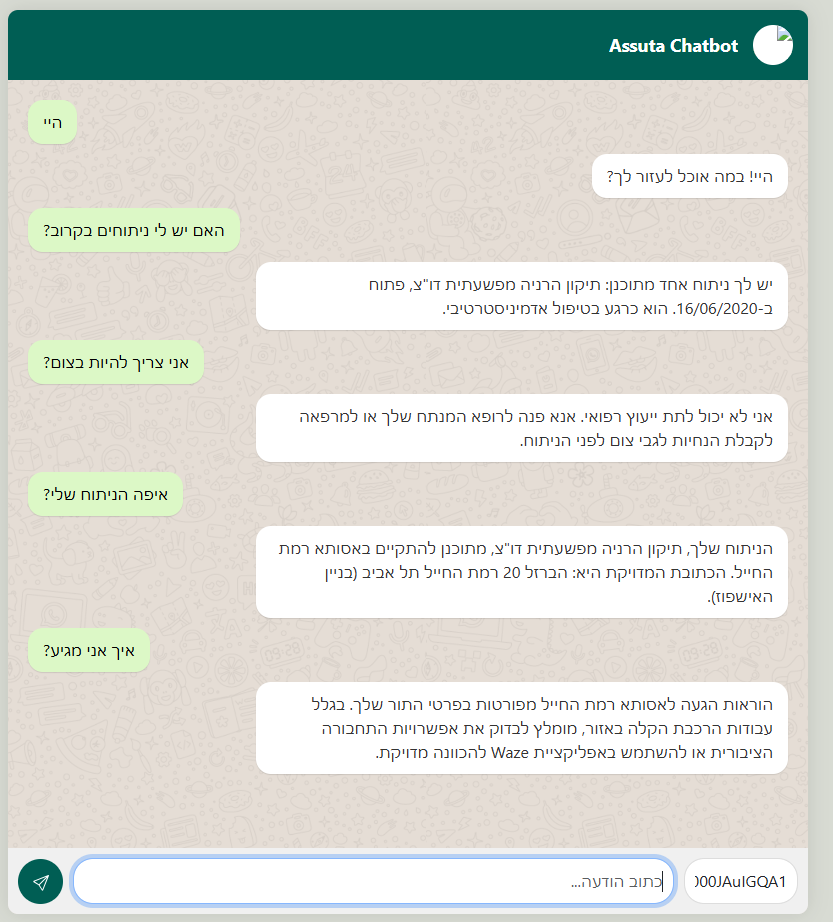

# Assuta Text-to-SQL Chatbot

This project is a simple web-based chatbot that allows users to ask questions in Hebrew about their appointments. The chatbot uses Google's Gemini API to understand natural language queries and retrieve information from a SQLite database.

## Features

-   **Natural Language Understanding:** Uses the Gemini API to interpret user questions.
-   **Database Integration:** Connects to a SQLite database to fetch appointment data.
-   **Web-Based UI:** Provides a simple and clean chat interface using Flask and Bootstrap.
-   **Hebrew Language Support:** The chatbot is configured to respond in Hebrew using a system prompt.
-   **Dockerized:** Includes a Dockerfile for easy containerization and deployment.

## Screenshot



## Project Structure

```
.
├── .env                    # Environment variables (contains GEMINI_API_KEY)
├── .gitignore              # Git ignore file
├── Dockerfile              # Dockerfile for building the container image
├── app.py                  # Flask web application
├── data/
│   └── db.csv              # CSV data for appointments
├── db_setup.py             # Script to create and populate the SQLite database
├── requirements.txt        # Python dependencies
├── system_prompt.txt       # System prompt for the Gemini model
└── templates/
    └── index.html          # HTML template for the chat UI
```

## Setup and Installation

### 1. Clone the Repository

```bash
git clone <repository-url>
cd assota_txt2sql_poc
```

### 2. Create and Activate a Virtual Environment

```bash
python3 -m venv venv
source venv/bin/activate
```

### 3. Install Dependencies

```bash
pip install -r requirements.txt
```

### 4. Set Up the Database

Run the `db_setup.py` script to create the `app_database.db` file from the CSV data.

```bash
python3 db_setup.py
```

### 5. Configure the API Key

Create a `.env` file in the root directory and add your Gemini API key:

```
GEMINI_API_KEY="YOUR_API_KEY"
```

## Running the Application

To start the Flask web server, run:

```bash
python3 app.py
```

Open your web browser and navigate to `http://127.0.0.1:5000` to start chatting.

## Running with Docker

You can also run the application using Docker.

### 1. Build the Docker Image

```bash
docker build -t assota-chatbot .
```

### 2. Run the Docker Container

Make sure to pass your Gemini API key as an environment variable.

```bash
docker run -p 5000:5000 -e GEMINI_API_KEY="YOUR_API_KEY" assota-chatbot
```

The application will be accessible at `http://127.0.0.1:5000`.